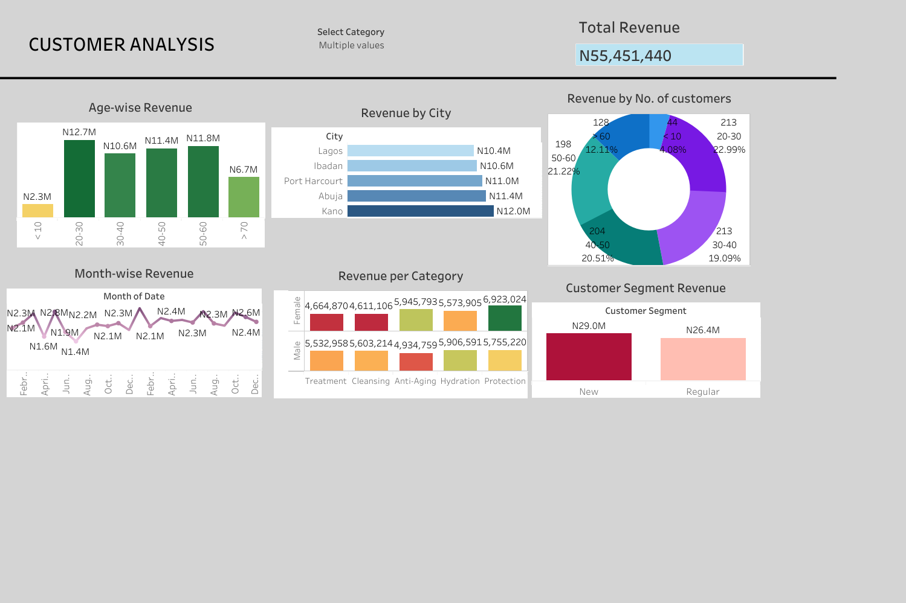

# Nigeria Skincare Revenue

## Sales Data Dashboard

This repository contains a dashboard created to analyze and visualize skincare sales data from the past three years. The project demonstrates my skills in data analysis, data visualization, and business intelligence using Python and Tableau.

## Project Overview

- **Data Source**: Sales data from a skincare company in Nigeria, spanning from 2022 to 2023.
- **Tools Used**: R, xcel, SQL and Tableau
  
- **Key Findings**:
More concentration should be given to ages 20-40, they produced the highest revenue for both years.
The Northern part of the country (Kano and Abuja) brought the highest revenue. Consider increasing the number of pick up and delivery points to encourage ease of shopping and supplying other neighboring states and possibly a walk-in store. With Walk-in, they can include complimentary items and services liike spa and other body treatment to increase revenue.
Newly acquired customers brought in the highest revenue for both years.




## Data Source

The data used for this analysis is contained in the [gourmet-bistro-sales.csv](https://github.com/Ibukun-Oluwatosin/Nigeria-Skincare-Revenue/blob/main/skincare_sales_data_csv.csv)` file. It includes various attributes such as date of sale, product category, sales channel, and sales amount.

## Tools and Technologies

- **R**: Used for data cleaning and initial analysis. Key libraries include Pandas for data manipulation and Matplotlib for basic visualizations.
- **Tableau**: Used for creating the final interactive dashboard.
- **excel spreadsheet**: clean data, create pivot tables and basic visualizations
    - [Download here](https://microsoft.com)

## Steps to Reproduce

1. **Clone the repository**:
   ```sh
   git clone ([https://ibukun-oluwatosin.github.io/skincare-sales-data/](https://github.com/Ibukun-Oluwatosin/Nigeria-Skincare-Revenue))
